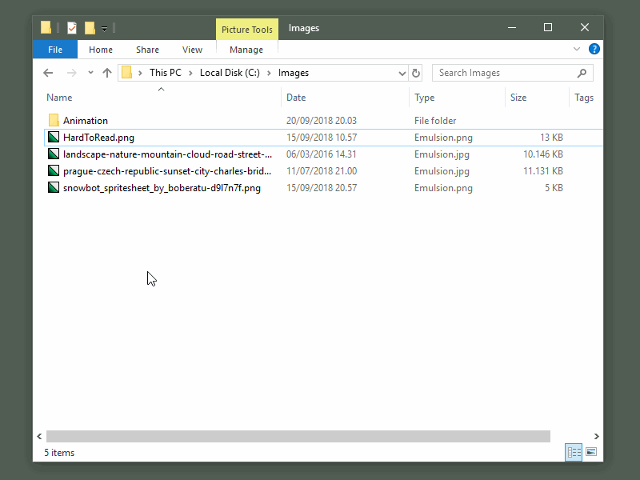
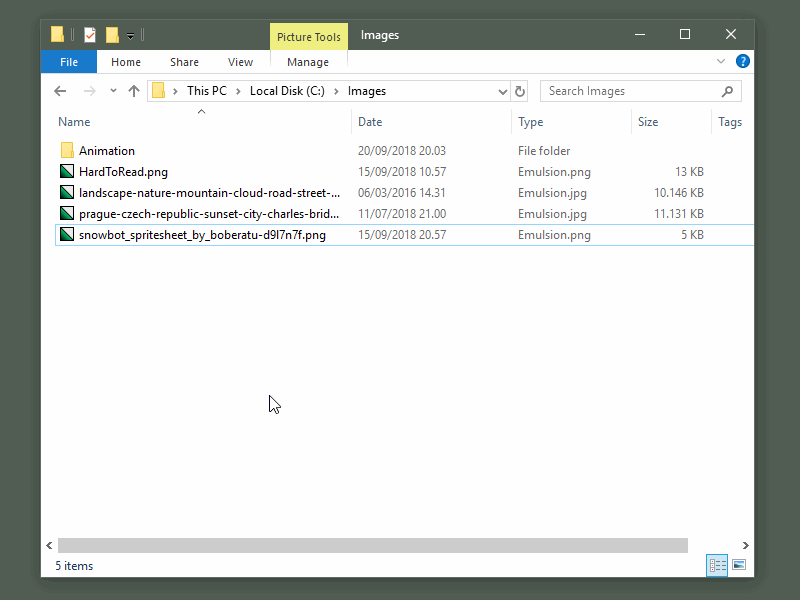
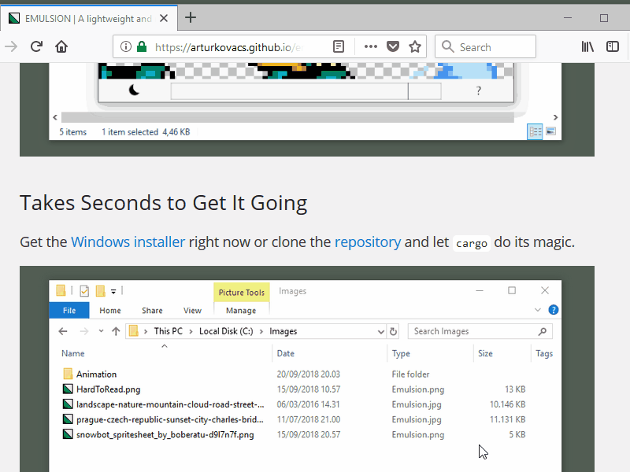

## Fast

Displays images instantly. So fast it can play back an animation right from an image file sequence.

  

## Light and Dark

Being able to quickly switch between a dark and a light interface may come in handy.

  

## Cursor Anchored Zoom

The viewer will move towards/away from the area under the cursor while zooming.

  

## Pixel Art Friendly

Automatically switches from smooth display to real pixels at a scale threshold.

  

## Takes Seconds to Get It Going

Get the [Windows installer](https://github.com/ArturKovacs/emulsion/releases/download/v1.1/Emulsion-Installer.exe) right now or clone the [repository](https://github.com/ArturKovacs/emulsion) and let `cargo` do its magic.

  

--------

### The Name

The word _emulsion_ in general refers to a substance in which two or more non-soluble liquids are mixed together so that the molecules are finely dispersed. For example mayonnaise is an emulsion of oil, egg yolk, and some acidic ingredient like vinegar or lemon juice.

Here emulsion refers to _photographic emulsion_ which is a substance that among other things can be used to develop images from.

In this sense emulsion is a thin layer that displays an image.

This description suits the program just as well. Emulsion is a thin layer between the operating system and the user as it is one single executable file accompanied by a few UI elements adding up to a size under 5 MBs.

### Details

Supported extensions are: 
JPG, JPEG, PNG, BMP, TGA, WEBP, TIF, TIFF, ICO, HDR, PBM, PAM, PPM, and PGM

Usage:

| Command                               | Input               |
| ------------------------------------- | ------------------- |
| Quit Emulsion                         | Esc                 |
| Previous Image                        | A or Left Arrow     |
| Next Image                            | D or Right Arrow    |
| Zoom In                               | Mouse Wheel Up      |
| Zoom Out                              | Mouse Wheel Down    |
| Fit Image To Window                   | F                   |
| Show At Original Scale                | Q                   |
| Toggle Animation Playback             | Space               |
| Toggle Presentation Playback          | P                   |
| Toggle Shuffled Presentation Playback | Ctrl + P            |
| Pan Camera                            | Left Click And Drag |

### Contribution is Welcome

Feel free to post bug reports, feature requests or even make pull requests on the [GitHub page](https://github.com/ArturKovacs/emulsion). The same goes to the GitHub page of this website which you can find [here](https://github.com/ArturKovacs/emulsion-website).

--------

#### Third-party Content

The pixel art image, [ice skating robot](https://www.deviantart.com/boberatu/art/Snowbot-Spritesheet-579824187) was created by devianart user [boberatu](https://www.deviantart.com/boberatu) and released under the [Creative Commons Attribution 3.0 License](http://creativecommons.org/licenses/by/3.0/).

